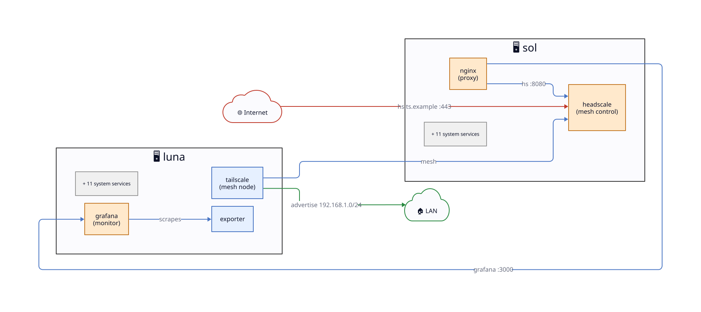
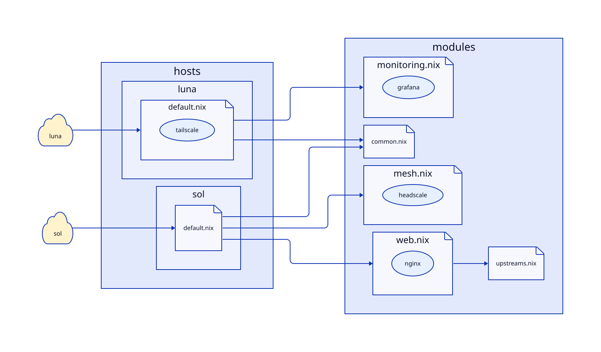
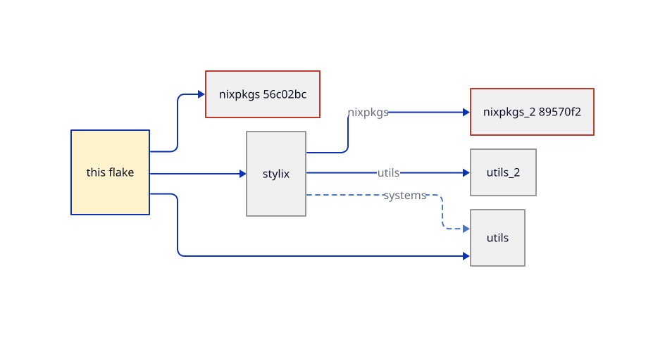
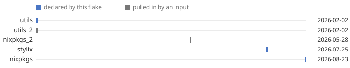
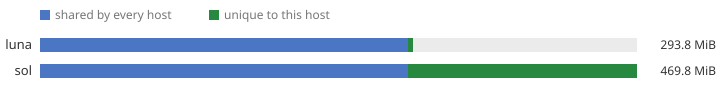
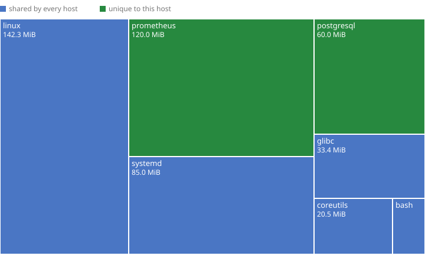

<samp>Static infrastructure docs from any Nix flake. nixdiag reads your
nixosConfigurations and darwinConfigurations and renders data-flow topology
diagrams, module trees and an mdBook wiki.</samp>

 

---

<picture><source media="(prefers-color-scheme: dark)" srcset="assets/topology.svg"></picture>

<picture><source media="(prefers-color-scheme: dark)" srcset="assets/modules.svg"></picture>

<picture><source media="(prefers-color-scheme: dark)" srcset="assets/inputs.svg"></picture>

<picture><source media="(prefers-color-scheme: dark)" srcset="assets/inputs-timeline.svg"></picture>

<picture><source media="(prefers-color-scheme: dark)" srcset="assets/closures.svg"></picture>

<picture><source media="(prefers-color-scheme: dark)" srcset="assets/closures-sol.svg"></picture>

---

## Docs

**<https://kucendro.github.io/nixdiag>**

- [Quickstart](https://kucendro.github.io/nixdiag/quickstart.html): first render in two commands
- [Annotations](https://kucendro.github.io/nixdiag/annotations.html): the full `#:` grammar
- [Cheat sheet](https://kucendro.github.io/nixdiag/syntax.html): the grammar on one page for your coding assistant, also `nixdiag syntax`
- [Build and serve](https://kucendro.github.io/nixdiag/build.html): `lib.mkDocs` as a pure derivation, the nginx module
- [CLI](https://kucendro.github.io/nixdiag/cli.html): `facts`, `render`, `gen`, `check`
- [Live demo](https://kucendro.github.io/nixdiag/demo/): the wiki this repo's test fixture renders

---

