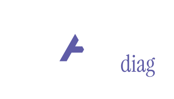
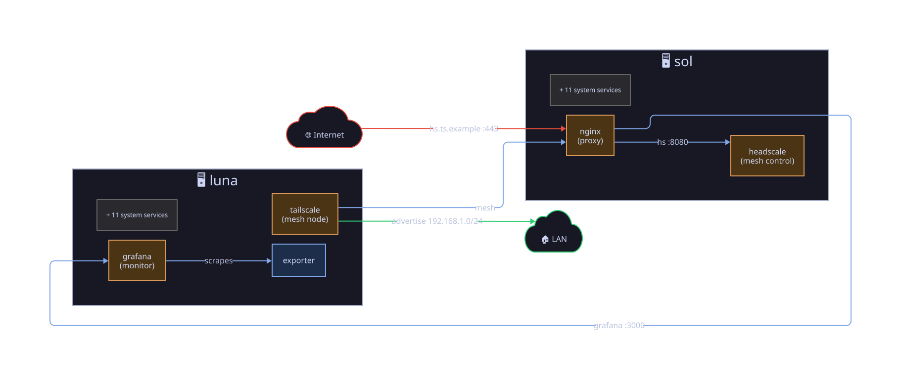
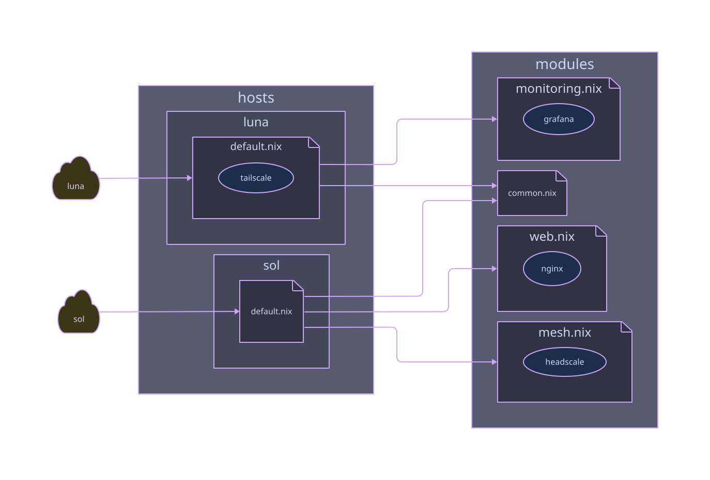

<samp>Static infrastructure docs from any Nix flake. nixdiag reads your
nixosConfigurations and darwinConfigurations and renders data-flow topology
diagrams, module trees and an mdBook wiki.</samp>

<br clear="left">

```sh
nix run github:kucendro/nixdiag -- gen --flake .
```

## Annotations

The topology is drawn from `#:` comments in your own module files (long form
`# nixdiag:`, also valid inside a leading `/** */` doc comment). A line above
a `services.<x>` / `programs.<x>` binding attaches to that service; file-level
lines attach to what the file defines, or to the host in a host entry module.

```nix
{
  #: mesh-control
  #: name hs.example.com
  #: expose 443 public name=hs.example.com
  services.headscale.enable = true;
}
```

| annotation | effect |
|---|---|
| `#: proxy` | role: node style + label. Roles: `mesh-control`, `mesh-node`, `proxy`, `monitor`, `agent`, `dns`, `storage`, `gateway`, or any word of your own |
| `#: expose 443 public name=hs.example.com` | endpoint: a row on the Endpoints wiki page, plus a cloud edge for `public` / `lan`. Scopes: `public`, `mesh`, `lan`; use `443/udp` for UDP |
| `#: -> nas/grafana metrics` | edge, label optional. Targets: `nas`, `nas/grafana`, `grafana`, a declared fqdn, `internet`, `lan`. `<-` reverses |
| `#: name hs.example.com` | address book: the fqdn becomes a valid edge target |
| `#: scope mesh` | default scope for this service's exposes |

The annotated two-host test fixture renders as:





## Build and serve

```nix
inputs.nixdiag.url = "github:kucendro/nixdiag";

# pure derivation: nix build .#docs, nothing to commit
packages.x86_64-linux.docs = nixdiag.lib.mkDocs {
  pkgs = nixpkgs.legacyPackages.x86_64-linux;
  flake = self;
  title = "my infrastructure wiki";
  theme = "light";               # default: dark on a transparent canvas
  background = "#ffffff";
  colors.public = "#ff5555";     # any name from the vars block in the d2 files
};

# nginx vhost, the wiki ships with every deploy
{
  imports = [ inputs.nixdiag.nixosModules.default ];
  services.nixdiag.serve = {
    enable = true;
    docs = inputs.self.packages.x86_64-linux.docs;
    virtualHost = "wiki.example.com";
  };
}
```

`nix flake init -t github:kucendro/nixdiag` scaffolds a documented flake.
