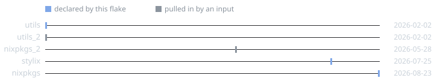
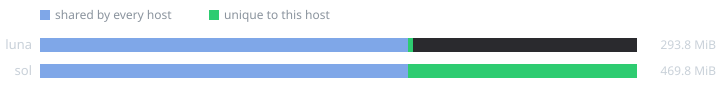
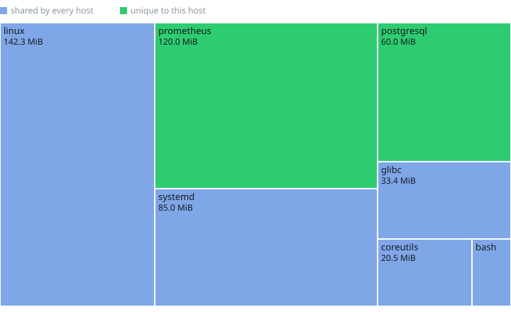

<samp>Static infrastructure docs from any Nix flake. nixdiag reads your
nixosConfigurations and darwinConfigurations and renders data-flow topology
diagrams, module trees and an mdBook wiki.</samp>

 

---

Every flake input placed by the date it is locked at, straight out of
`flake.lock` — no eval, no clock, and blue for the inputs your own flake
declares:

Opt in to closure metrics and each host is measured against the rest of the
fleet, then broken down by package:

nixdiag draws those three itself rather than through d2, so they need no
binary on PATH and come out byte-identical run to run — which is what lets
`nixdiag check` hold a picture to a diff.

---

## Docs

**<https://kucendro.github.io/nixdiag>**

- [Quickstart](https://kucendro.github.io/nixdiag/quickstart.html): first render in two commands
- [Annotations](https://kucendro.github.io/nixdiag/annotations.html): the full `#:` grammar
- [Build and serve](https://kucendro.github.io/nixdiag/build.html): `lib.mkDocs` as a pure derivation, the nginx module
- [CLI](https://kucendro.github.io/nixdiag/cli.html): `facts`, `render`, `gen`, `check`
- [Live demo](https://kucendro.github.io/nixdiag/demo/): the wiki this repo's test fixture renders
