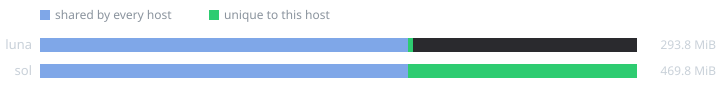
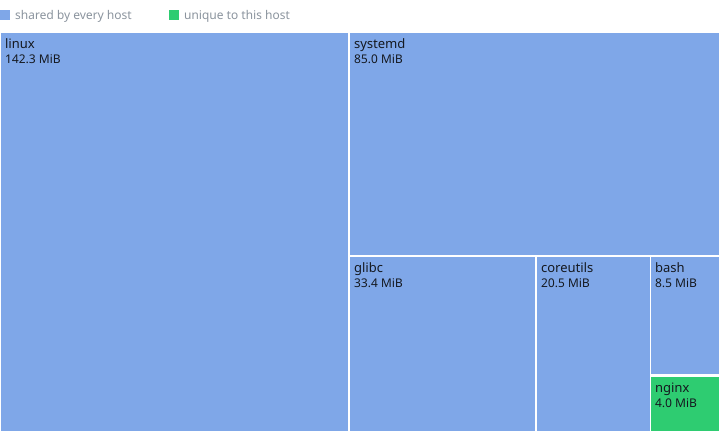
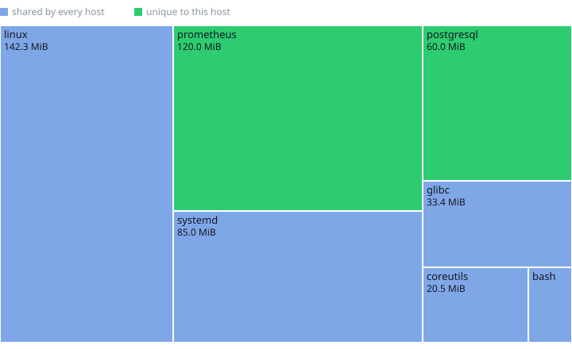

<!-- Auto-generated from the Nix config by nixdiag. Do not edit. -->

# Closures

NixOS hosts only — a darwin system cannot be built from Linux. A host shown as — was not measured; a host serving these docs cannot measure itself, since the docs would then depend on a system containing them.

| Host | Closure | Paths | Unique |
|---|---|---|---|
| `luna` | 293.8 MiB | 6 | 4.0 MiB |
| `sol` | 469.8 MiB | 7 | 180.0 MiB |

## Fleet

| | |
|---|---|
| Shared by every host | 289.8 MiB (5 paths) |
| Fleet total, deduplicated | 473.8 MiB (8 paths) |
| Sum of per-host closures | 763.5 MiB |
| Saved by sharing | 289.8 MiB |

## luna

Largest single paths:

| Package | Size |
|---|---|
| `linux-6.12.9` | 142.3 MiB |
| `systemd-257.2` | 85.0 MiB |
| `glibc-2.42-67` | 33.4 MiB |
| `coreutils-9.6` | 20.5 MiB |
| `bash-5.2p37` | 8.5 MiB |
| `nginx-1.26.2` | 4.0 MiB |

## sol

Largest single paths:

| Package | Size |
|---|---|
| `linux-6.12.9` | 142.3 MiB |
| `prometheus-3.1.0` | 120.0 MiB |
| `systemd-257.2` | 85.0 MiB |
| `postgresql-16.6` | 60.0 MiB |
| `glibc-2.42-67` | 33.4 MiB |
| `coreutils-9.6` | 20.5 MiB |
| `bash-5.2p37` | 8.5 MiB |
