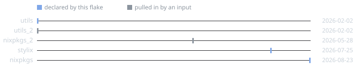

<!-- Auto-generated from the Nix config by nixdiag. Do not edit. -->

# Inputs

What this flake depends on, read from `flake.lock`. Dashed edges are `follows`, which is what *removes* a duplicate rather than adding one.


| Input | Source | Rev | Locked |
|---|---|---|---|
| `nixpkgs` | `github:nixos/nixpkgs` | `56c02bc` | 2026-08-23 |
| `nixpkgs_2` | `github:NixOS/nixpkgs` | `89570f2` | 2026-05-28 |
| `stylix` | `github:danth/stylix` | `a1b2c3d` | 2026-07-25 |
| `utils` | `github:numtide/flake-utils` | `11707dc` | 2026-02-02 |
| `utils_2` | `github:numtide/flake-utils` | `11707dc` | 2026-02-02 |

## Lock dates



Where each input's `lastModified` sits relative to the rest. That is a fixed integer in the lock rather than a clock read, so this is the *spread* of the supply chain and makes no claim about today.

**202 days** separate the oldest input from the newest.

## Duplicate inputs

`github:nixos/nixpkgs` is locked at **2 revisions**, so every copy is fetched and evaluated separately:

| Rev | Node | Pulled in by |
|---|---|---|
| `56c02bc` | `nixpkgs` | this flake |
| `89570f2` | `nixpkgs_2` | `stylix` (as `nixpkgs`) |

Point the extra copies at `nixpkgs`:

```nix
inputs.stylix.inputs.nixpkgs.follows = "nixpkgs";
```

## Redundant inputs

Locked at a single revision, but reached under more than one node name. Harmless, though a `follows` would drop the extra fetch.

- `github:numtide/flake-utils` — `utils`, `utils_2`
